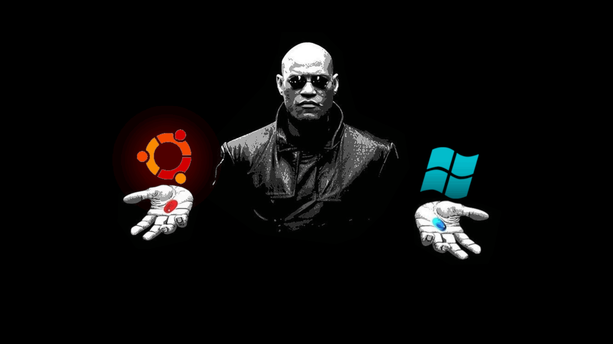

# Matrix Ubuntu GRUB Theme
**Red Pill vs Blue Pill**

A minimalist Matrix-inspired GRUB theme featuring full-screen dynamic backgrounds that change between Linux and Windows.

---

**Note:**
No code has been changed from the original **Matrix Morpheus GRUB Theme**, I just added the **Ubuntu** version for it.
Installation should be completely identical, so you can also just copy the **ubuntu.png** and copy it to your existing
**Matrix Morpheus GRUB Theme**.

Also, while the icons are **arranged horizontally** on screen,
you still navigate using the **Up** and **Down arrow keys** as in a normal GRUB menu.

---

## Installation

1. Clone the repo

```shell
git clone git@github.com:asterix234567/Matrix-Ubuntu-GRUB-Theme.git
```

2. Go into the folder

```shell
cd Matrix-Ubuntu-GRUB-Theme
```

3. Make the installer executable

```shell
chmod +x install.sh
```

4. Execute the installation script as admin

```shell
sudo ./install.sh
```

5. Reboot to test your new theme

---
Optional: Simplify Your GRUB Menu

I designed this theme for a two entry layout and haven't really thought about how to visually handle the additional entries.

If your GRUB menu currently has extra entries such as:

- “Advanced options for Ubuntu Linux”
- “UEFI Firmware Settings”

I would recommend you remove the extra menu entries from the grub config if you don't use them.

For removing the unwanted menu entries, I used **Grub Customizer**. Even though the programm is being discussed online,
it worked for this task very well.

Hope everything works and u like it.
